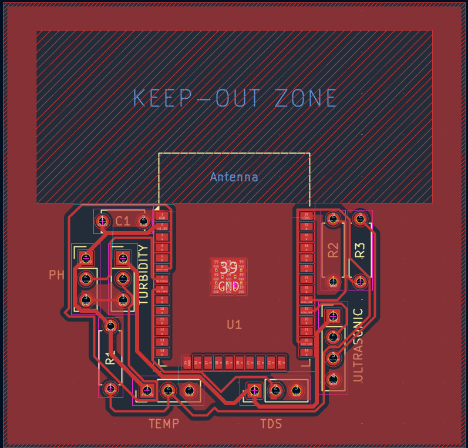
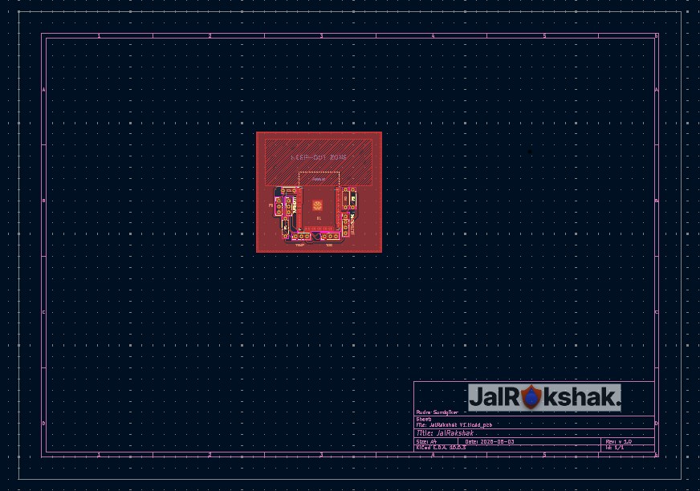

  

<h1 align="center"> JalRakshak </h1>

  Water Monitoring Device

  An ESP-32 powered "floating" water monitoring device with pH, Temperature, TDS and Turbidity sensors!

# Index

### [1) What is JalRakshak?](#what-is-jalrakshak)
### [2) Why was JalRakshak made?](#why-was-jalrakshak-made)
### [3) Key Features](#key-features)
### [4) PCB](#pcb)
### [5) Images](#images)
### [6) How to Run?](#how-to-run)
### [7) Credits](#credits)
### [8) License](#license)

# What is JalRakshak?

JalRakshak is an ESP32 powered water quality monitoring device, that continously measures pH, TDS, Turbidity, Temperature and Water Level! It uses a custom built PCB and enclosure to help communities protect lakes, reservoirs and local water bodies.

 
   

 A basic 3D outline of JalRakshak V1

# Why was JalRakshak made?

Water pollution is one of the biggest challenges to the environment in recent days. Not only does it affect aquatic fauna, it can also cause significant damage to humans due to unhygenic conditions of water. This issue is widespread in rural areas, especially in the country I am from, India. To help combat this issue, even at a significantly smaller scale, JalRakshak was created. Attached is a link to a credible source which discusses the major problems caused due to water pollution - 

https://www.frontiersin.org/journals/environmental-science/articles/10.3389/fenvs.2022.880246/full

# Key Features

- ESP32 microcontroller with integrated Wi-Fi
- Analyses Temperature, TDS, Turbidity, pH and Water Level
- Sends an alert via email when safety threshold is exceeded
- Custom designed PCB for sensor integration
- DS18B20 waterproof temperature sensor
- DFRobot Gravity pH and TDS sensor
- SEN0189 turbidity sensing for water clarity check
- HC-SR04 ultrasonic water level measurement
- Custom CAD optimised to float on water

# PCB

  

  Fig. 1) Top view of the PCB layout for JalRakshak

  

  Fig. 2) Manufacturing layout of the PCB design

  
  

