<p align="center">
  
</p>

<h1 align="center"> JalRakshak </h1>

<p align="center">
  Water Monitoring Device
</p>

<p align="center">
  An ESP-32 powered "floating" water monitoring device with pH, Temperature, TDS and Turbidity sensors!
</p>


# Index

#### [1) JalRakshak Zine](#jalrakshak-zine)
#### [2) What is JalRakshak?](#what-is-jalrakshak)
#### [3) Why was JalRakshak made?](#why-was-jalrakshak-made)
#### [4) Key Features](#key-features)
#### [5) PCB](#pcb)
#### [6) Images](#images)
#### [7) How to Build and Run?](#how-to-build-and-run)
#### [8) Credits](#credits)
#### [9) License](#license)

# JalRakshak Zine

<p align="center">
  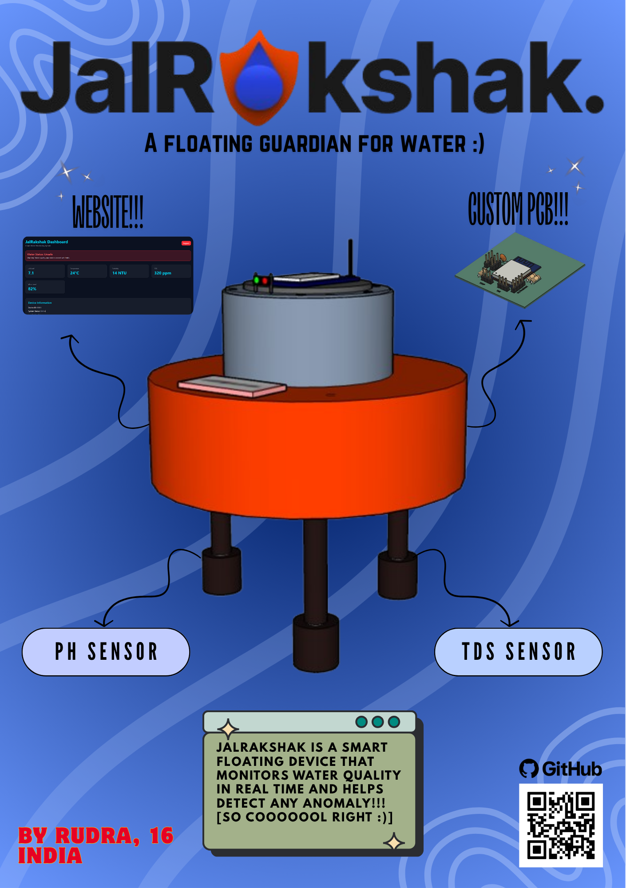
</p>

# What is JalRakshak?

JalRakshak is an ESP32 powered water quality monitoring device, that continously measures pH, TDS, Turbidity, Temperature and Water Level! It uses a custom built PCB and enclosure to help communities protect lakes, reservoirs and local water bodies.

<p align="center"> 
  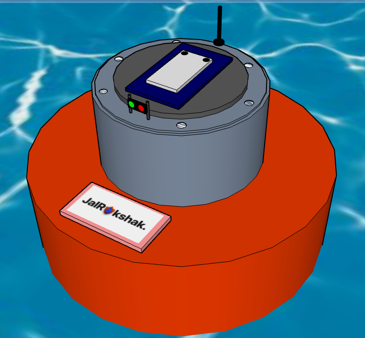 
</p>

<p align="center">
 A basic 3D outline of JalRakshak V1
</p>

# Why was JalRakshak made?

Water pollution is one of the biggest challenges to the environment in recent days. Not only does it affect aquatic fauna, it can also cause significant damage to humans due to unhygenic conditions of water. This issue is widespread in rural areas, especially in the country I am from, India. To help combat this issue, even at a significantly smaller scale, JalRakshak was created. Attached is a link to a credible source which discusses the major problems caused due to water pollution - 

https://www.frontiersin.org/journals/environmental-science/articles/10.3389/fenvs.2022.880246/full

# Key Features

- ESP32 microcontroller with integrated Wi-Fi
- Analyses Temperature, TDS, Turbidity, pH and Water Level
- Sends an alert via email when safety threshold is exceeded
- Custom designed PCB for sensor integration
- DS18B20 waterproof temperature sensor
- DFRobot Gravity pH and TDS sensor
- SEN0189 turbidity sensing for water clarity check
- HC-SR04 ultrasonic water level measurement
- Custom CAD optimised to float on water

# PCB
<p align="center">
  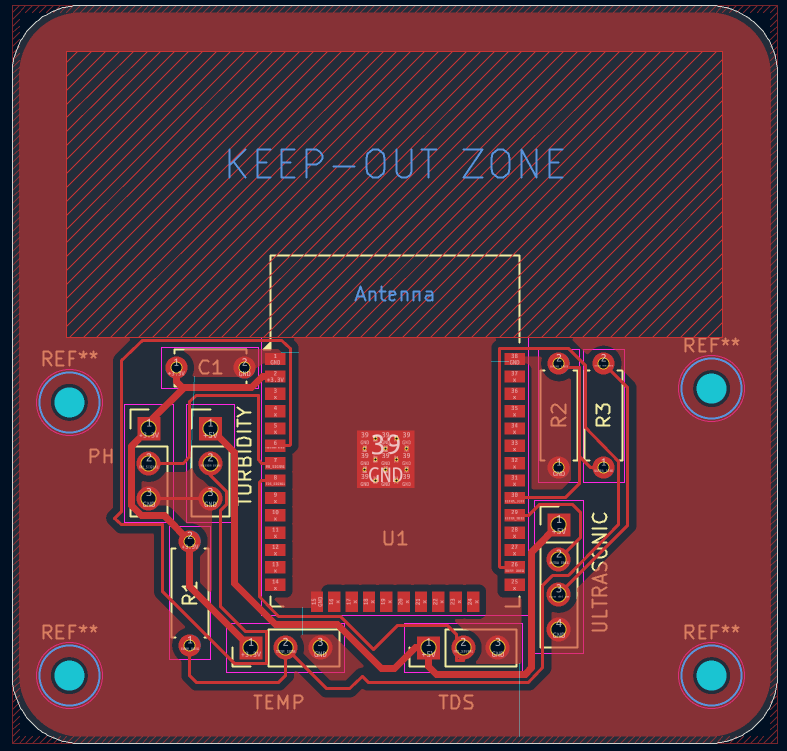
</p>
<p align="center">
  Fig. 1) Top view of the PCB layout for JalRakshak
</p>
<p align="center">
  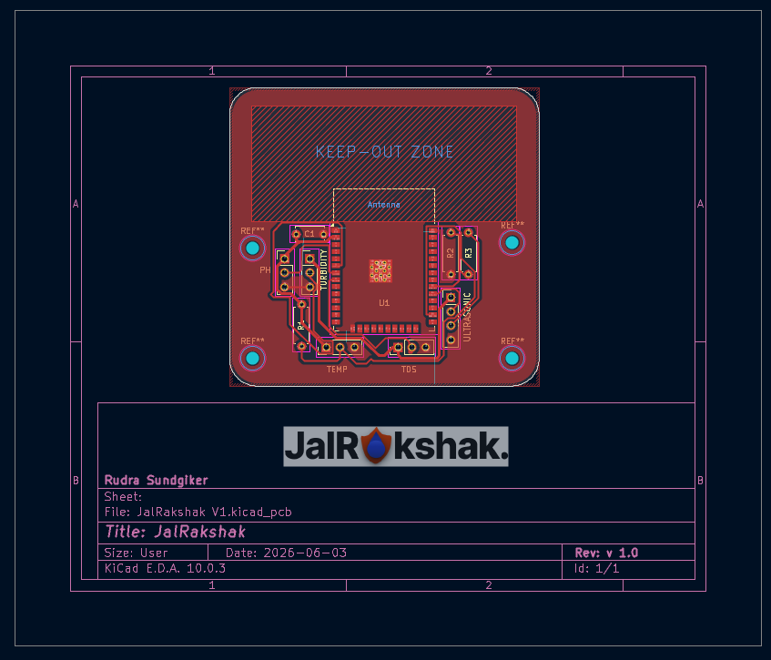
</p>
<p align="center">
  Fig. 2) Manufacturing layout of the PCB design
</p>
<p align="center">
  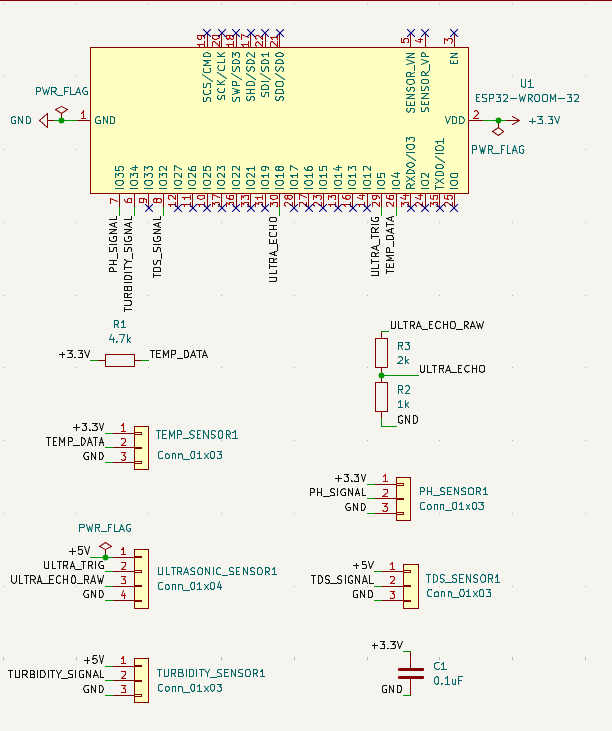
</p>
<p align="center">
  Fig. 3) Schematic design of JalRakshak
</p>

# Images

<details>
<summary><b> 3D Model</b></summary>

<br>

<p align="center">
  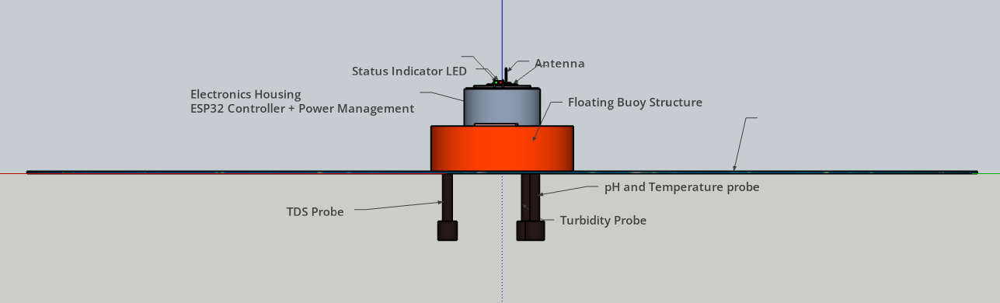
  <br>
  <em>Fully assembled JalRakshak enclosure.</em>
</p>

<br>

<p align="center">
  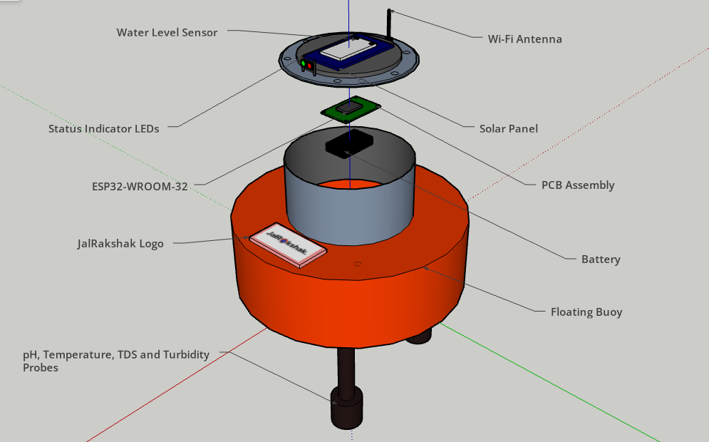
  <br>
  <em>Exploded view showing internal components.</em>
</p>

<br>

<p align="center">
  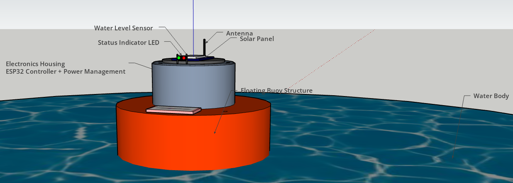
  <br>
  <em>Deployed image of a JalRakshak model.</em>
</p>
</details>

<details>
<summary><b> Dashboard </b></summary>

<br>

<p align="center">
  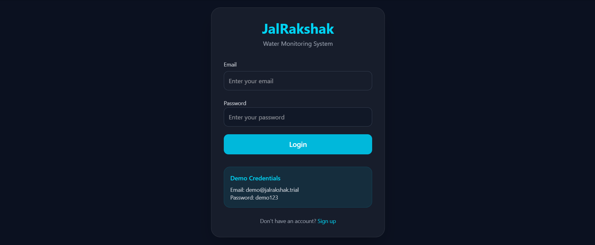
  <br>
  <em>Sign Up/Login page of JalRakshak.</em>
</p>

<br>

<p align="center">
  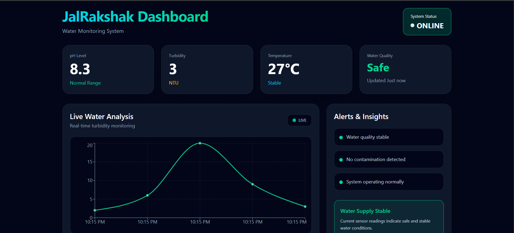
  <br>
  <em>Frontend dashboard of JalRakshak website.</em>
</p>
</details>

<details>
<summary><b>3D PCB Visuals</b></summary>

<br>

<p align="center">
  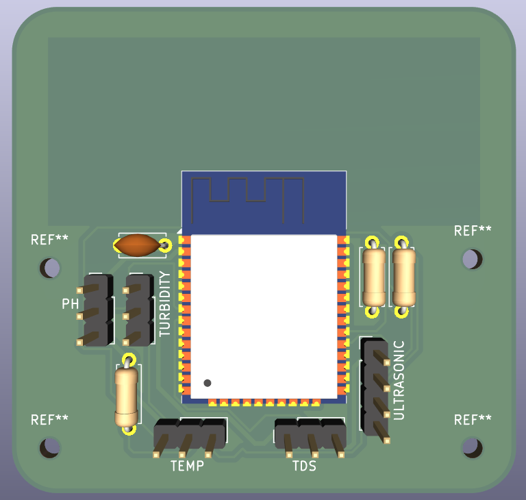
  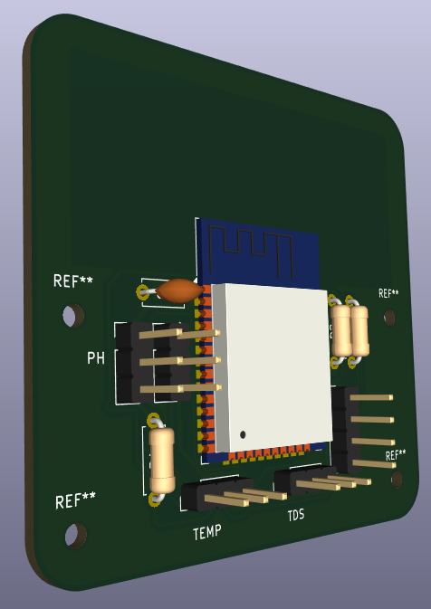
  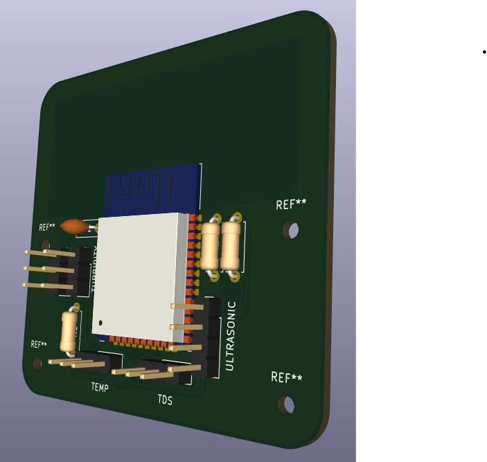
  <br>
  <em>Visuals of 3D version of PCB.</em>
</p>
</details>


<details>
<summary><b> Other essentials </b></summary>

<br>

<p align="center">
  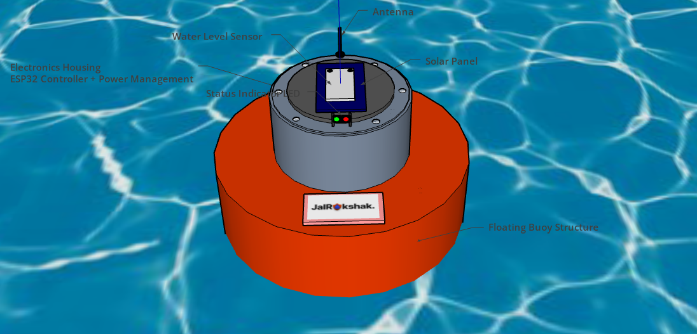
  <br>
  <em>Other visual of JalRakshak.</em>
</p>

<p align="center">
  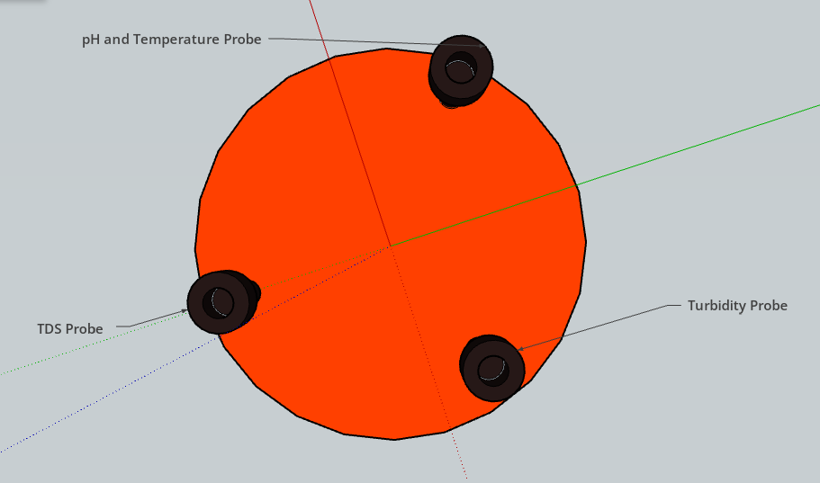
  <br>
  <em>Visuals of all the probes of JalRakshak.</em>
</p>

<p align="center">
  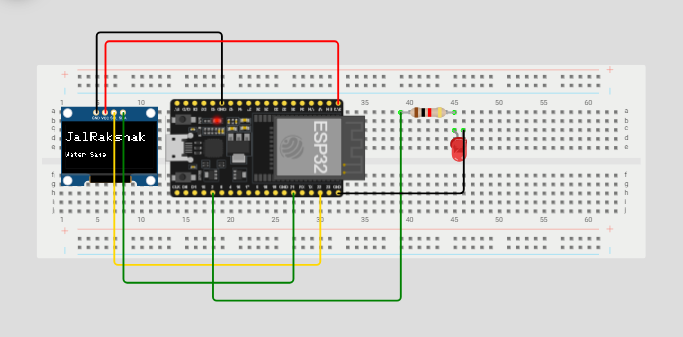
  <br>
  <em>Demo prototype of screen of JalRakshak.</em>
</p>
</details>

# How to Build and Run?

>⚠️ Note: At the time of writing, JalRakshak is in the prototype development stage. The assembly and deployment instructions below describe the intended hardware workflow based on the completed PCB, CAD enclosure and firmware design.

Please check the [BOM](BOM.csv) before building this project!

<details>
<summary><b> Hardware </b></summary>

<br>

1. Fabricate or order the JalRakshak PCB using the provided [Gerber](hardware/gerbers) files.
2. Solder the ESP32 and supporting components onto the PCB.
3. Connect the sensors to their designated headers:
   - pH Sensor
   - TDS Sensor
   - Turbidity Sensor
   - DS18B20 Temperature Sensor
   - HC-SR04 Ultrasonic Sensor
4. Mount the PCB inside the enclosure.
5. Route the sensor cables through the enclosure openings.
6. Secure all components and close the enclosure.

</details>

<details>
<summary><b> Firmware Installation </b></summary>

<br>

1. Open the Arduino IDE.
2. Install ESP32 board support through the Board Manager.
3. Install the required libraries:
   - OneWire
   - DallasTemperature
4. Open firmware/jalrakshak_main.ino
5. Upload the firmware to the ESP32.

</details>

<details>
<summary><b> Wiring </b></summary>

<br>

Connect all sensors to the custom JalRakshak PCB according to the schematic available in the repository.

| Component | Connection Type |
|------------|----------------|
| pH Sensor | Analog Input |
| TDS Sensor | Analog Input |
| Turbidity Sensor | Analog Input |
| DS18B20 Temperature Sensor | Digital GPIO |
| HC-SR04 Ultrasonic Sensor | Trigger/Echo GPIO |
| ESP32 | Main Controller |

Refer to the PCB schematic and wiring diagram in the `hardware/pcb` directory for detailed pin mappings.

</details>

<details>
<summary><b> Backend Setup </b></summary>

1. Navigate to the backend directory.
```bash
cd backend
```
2. Create and activate a Python virtual environment.
```bash
python -m venv venv
```
3. Install dependencies.
```bash
pip install -r requirements.txt
```
4. Configure PostgreSQL credentials.
5. Start the FastAPI server.
```bash
uvicorn app.main:app --reload
```

</details>

<details>
<summary><b> Dashboard setup </b></summary>

<br>

1. Navigate to the frontend directory.
```bash
cd frontend
```
2. Install dependencies.
```bash
npm install
```
3. Start the development server.
```bash
npm run dev
```
6. Open the URL displayed in the terminal.
7. Ensure the backend server is running and connected to the database.
8. Verify that live sensor readings are visible on the dashboard.

</details>

<details>
<summary><b> Operation </b></summary>

<br>

1. Power on the device.
2. Place JalRakshak on the water surface.
3. Ensure all sensors are submerged properly.
4. Open the Serial Monitor at 115200 baud.
5. Observe live readings for:
   - pH
   - TDS
   - Temperature
   - Turbidity
   - Water Level
6. Voila! Your very own version of JalRakshak is prepared!
</details>

# Credits

I would like to thank-

[KiCad](https://www.kicad.org/)

[Arduino](https://www.arduino.cc/)

[HackClub Fallout](https://fallout.hackclub.com/)

[SketchUp](https://www.sketchup.com/)

[PostgresSQL](https://www.postgresql.org/)

# License 

This project is licensed under the MIT License. See the [LICENSE](LICENSE) file for more details.


